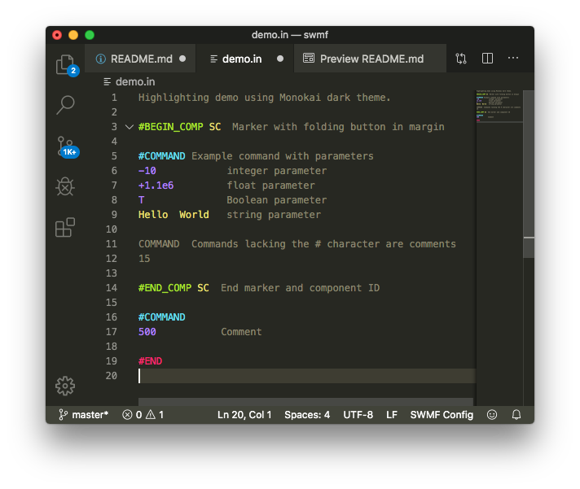

# SWMF configuration file syntax highlighting

Syntax highlighting and some code completion for [Space Weather Modelling Framework (SWMF)](http://csem.engin.umich.edu/tools/swmf/) configuration files, such as the BATSRUS `PARAM.in` file. The rules are based on the [SWMF manual](http://csem.engin.umich.edu/tools/swmf/documentation/SWMF.pdf) section 3.2.2.

Automatically highlights files ending in `.in` and `.IN`.

A document tree is also provided in the outline view.

## Features

 * Syntax highlighting 
 * Comment/uncomment using `!` as comment character.
 * Hierarchical document tree in outline view.
 * Code folding between `#BEGIN_COMP` and `#END_COMP` markers.
 * Autoclosing of `#BEGIN_COMP`.
